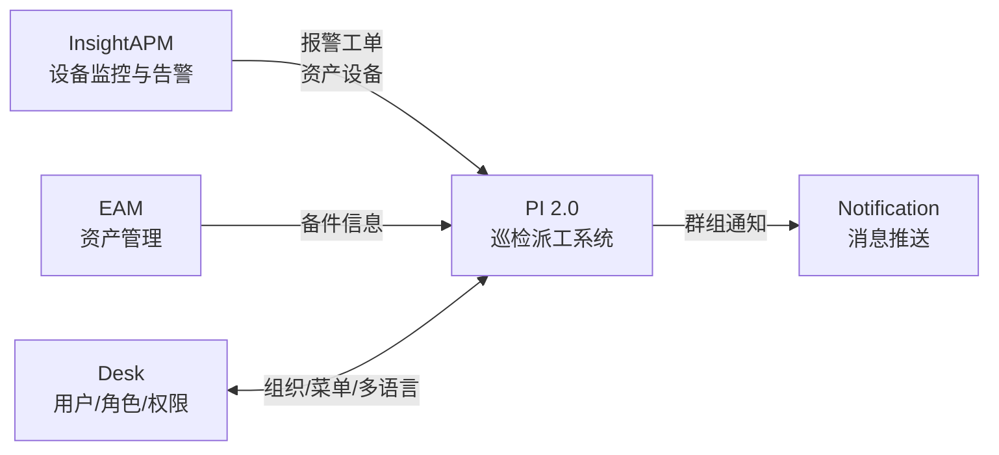
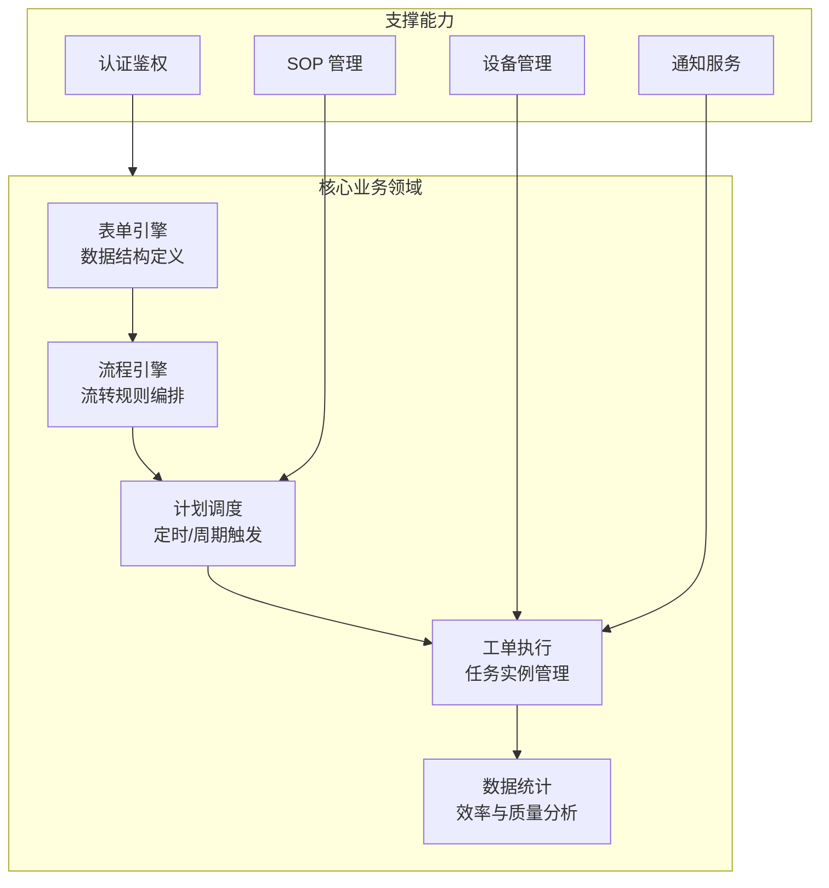
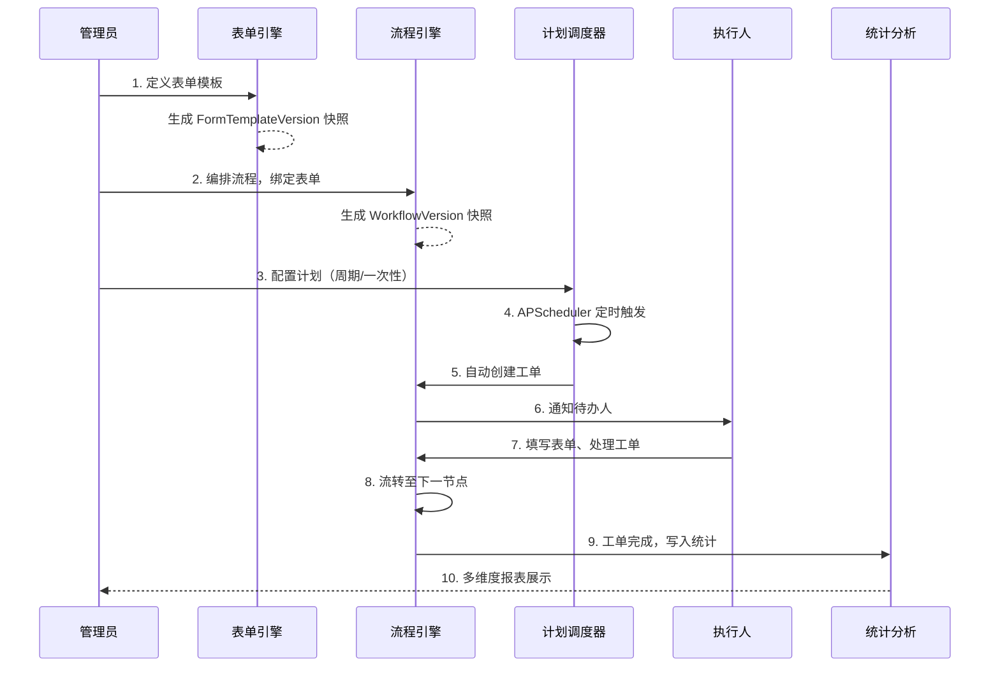
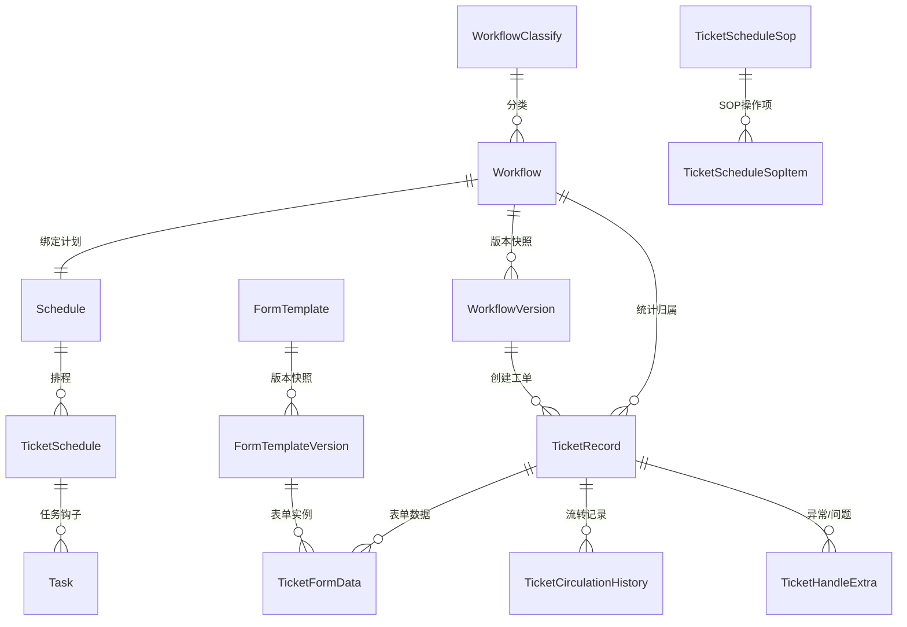
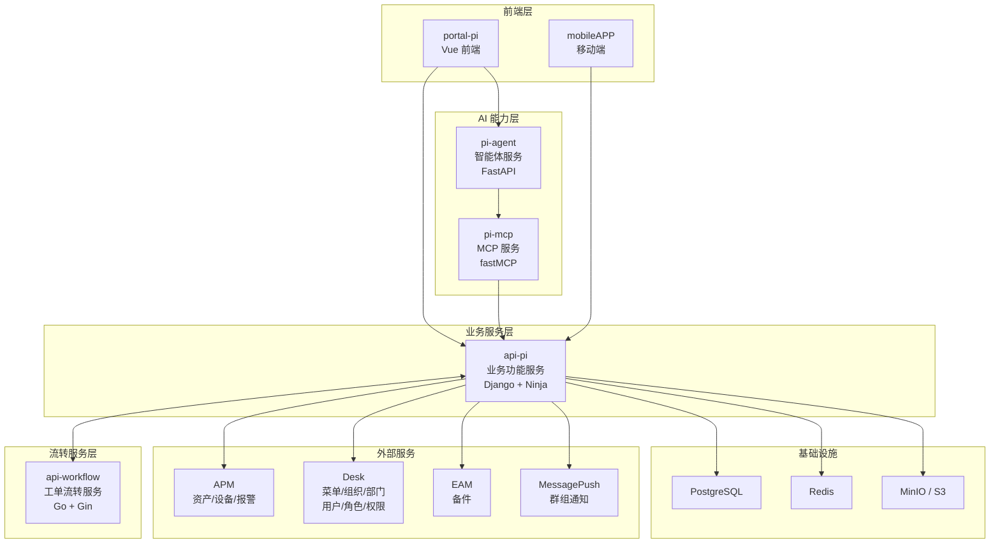
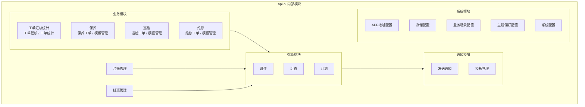
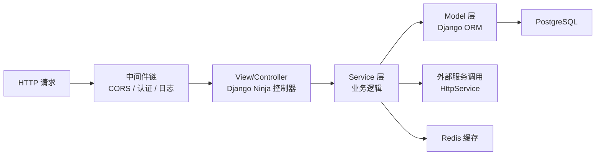
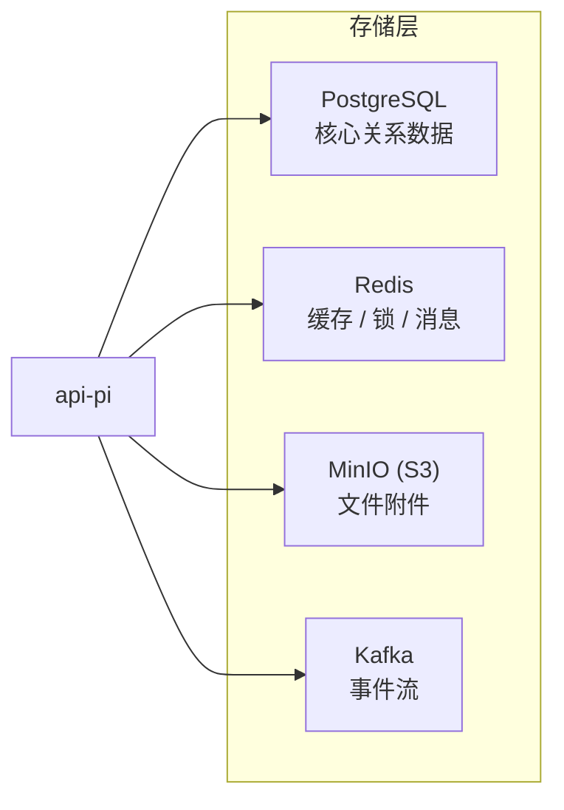
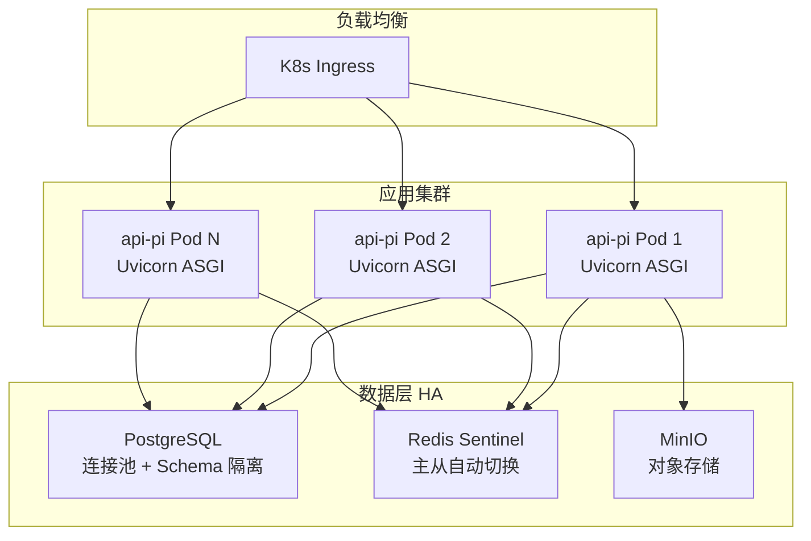

# 巡检派工系统 (PI 2.0) 技术架构设计文档

> **版本**: 2.0.1  
> **文档性质**: 技术架构设计报告  
> **适用范围**: CTO 技术评审 / 架构决策参考

---

## 一、产品 Feature 概览

### 1.1 核心功能与业务价值

巡检派工系统 (PI 2.0) 是面向工业设备运维场景的**全生命周期工单管理平台**，通过"表单引擎 + 流程引擎 + 计划调度 + 工单执行"四位一体的设计，实现了设备巡检、保养、维修业务的数字化闭环管理。

**核心能力矩阵：**


| 能力维度         | 功能说明                                      | 业务价值                           |
| ------------ | ----------------------------------------- | ------------------------------ |
| **表单引擎**     | 可视化表单设计器，支持 SOP 组件、设备组件、自定义字段等丰富组件；支持版本管理 | 适应不同行业、不同设备类型的数据采集需求，零代码定义业务表单 |
| **流程引擎**     | 拖拽式流程编排，支持多节点审批、条件分支、超时升级、自动通知            | 灵活匹配不同组织的管理流程，工单流转全程可追溯        |
| **计划调度**     | 支持一次性 / 周期性 / 日历例外等复杂调度策略，计划与流程自动关联       | 实现巡检计划、保养计划的自动化派单，降低人工调度成本     |
| **工单执行**     | 工单创建、领取、处理、转交、暂存、催办、关闭的完整生命周期管理           | 工单全链路数字化，支撑效率分析与质量回溯           |
| **SOP 管理**   | 标准作业程序定义、设备类型关联、操作项与文档管理                  | 规范作业流程，降低人员培训成本，保障操作一致性        |
| **数据统计**     | 多维度工单统计（总体 / 时段 / 设备），工时统计，异常排名           | 为管理层提供运维效率与设备健康的量化决策依据         |
| **AI Agent** | 基于 MCP 协议的智能体服务，封装工单/流程查询等能力              | 支持自然语言交互，降低系统使用门槛              |


### 1.2 与兄弟产品的协同关系

PI 2.0 在产品矩阵中承担**设备运维执行层**的角色，与其他产品形成互补：




- **与 InsightAPM 的差异**：APM 侧重设备实时监控与告警触发，PI 侧重告警后的工单流转与任务执行；APM 提供台账数据与报警工单，PI 消费并驱动后续运维流程。
- **与 EAM 的差异**：EAM 管理资产全生命周期（采购、入库、折旧），PI 专注资产运维阶段的巡检保养任务调度。
- **独有特性**：PI 的核心竞争力在于"流程可编排、表单可定义、计划可调度"的灵活性设计，使得同一平台可适配巡检、保养、维修、报修等不同业务场景，无需二次开发。

---

## 二、核心逻辑架构说明（非微服务视角）

### 2.1 系统整体视角

从系统整体视角出发，PI 2.0 的核心设计围绕五个关键领域展开：




### 2.2 设备管理

系统采用**集成式设备管理**策略：

- **内部模型**：`Device` 实体存储设备基本信息（编码、名称、类型、位置、品牌、型号），作为工单关联的设备标识。
- **外部集成**：通过 `STANDING_BOOK_URL` 对接 APM 台账服务（api-m2i），获取完整的设备台账数据，包括设备层级关系、设备类型树等。
- **设备类型管理**：`SysDeviceType` 模型存储设备类型元数据，支撑 SOP 按设备类型关联。

### 2.3 数据流：从定义到执行的完整闭环




关键设计决策：

- **版本快照机制**：工单创建时绑定 `WorkflowVersion` 和 `FormTemplateVersion` 快照，确保流程或表单的后续修改不影响已创建工单的历史数据完整性。
- **表单数据与结构分离**：`FormTemplate` 定义结构，`TicketFormData` 存储实例数据，通过 `form_version` 外键关联特定版本，实现同一表单多版本并存。

### 2.4 数据库设计

系统采用 PostgreSQL 关系型数据库，共 37 张表、25 个外键关系，按领域划分为以下核心域：




**核心数据域说明：**


| 数据域      | 核心实体                                                                      | 职责                    |
| -------- | ------------------------------------------------------------------------- | --------------------- |
| **工作流域** | Workflow, WorkflowVersion, WorkflowClassify                               | 流程定义、版本管理、分类管理        |
| **表单域**  | FormTemplate, FormTemplateVersion                                         | 表单结构定义、版本快照           |
| **工单域**  | TicketRecord, TicketFormData, TicketCirculationHistory, TicketHandleExtra | 工单生命周期、表单数据、流转历史、异常记录 |
| **计划域**  | Schedule, TicketSchedule, TicketScheduleSop, TicketScheduleSopItem        | 调度规则、排程管理、SOP 定义      |
| **系统域**  | SysUser, SysDept, SysRole, Dictionary, NoticeTemplate, TimeoutConfig      | 用户体系、数据字典、通知模板、超时规则   |


**数据模型分层设计：**

所有业务实体继承统一的基础模型层级：

- `OrgModel`：多租户基础（`org_id` 租户隔离）
- `TimeModel` ← `OrgModel`：统一时间戳（`create_time`, `update_time`, `delete_time` 软删除）
- `BaseModel` ← `TimeModel`：审计字段（`create_by`, `update_by`）

该设计保证了全局一致的多租户隔离、时间审计和软删除能力。

### 2.5 内部消息总线

系统内部采用多种消息机制协同工作：


| 消息机制     | 技术选型                       | 用途                                  |
| -------- | -------------------------- | ----------------------------------- |
| **定时调度** | APScheduler + 自定义 JobStore | 计划执行触发、提前通知推送                       |
| **异步任务** | Celery + Redis Backend     | 邮件发送等异步操作                           |
| **事件通知** | Kafka (kafka-python3)      | 工单状态变更事件的异步推送                       |
| **系统广播** | Redis Pub/Sub              | 系统变量变更通知（`PI_SYS_VARIABLE_CHANGED`） |
| **实时通信** | Django Channels + Redis    | WebSocket 实时推送                      |


---

## 三、微服务关系架构说明

### 3.1 逻辑架构与微服务的映射

PI 2.0 采用**领域驱动的微服务拆分策略**，将系统划分为 5 个独立服务：




**服务职责边界：**


| 服务               | 技术栈                         | 职责                                  | 通信方式              |
| ---------------- | --------------------------- | ----------------------------------- | ----------------- |
| **portal-pi**    | Vue.js                      | Web 前端 UI，用户交互入口                    | HTTP → api-pi     |
| **api-pi**       | Python / Django 4.2 + Ninja | 核心业务服务：工单、流程、表单、计划、排班、通知、统计、设备、用户管理 | 作为 BFF 对外提供统一 API |
| **api-workflow** | Go / Gin                    | 工单流转引擎：节点推进、条件判断、状态机管理              | 仅与 api-pi 通信      |
| **pi-agent**     | Python / FastAPI            | AI 智能体：自然语言理解，表单/流程/任务编排            | 调用 pi-mcp         |
| **pi-mcp**       | Python / fastMCP            | MCP 协议服务：封装流程/表单/工单查询能力，供 Agent 调用  | 调用 api-pi         |


**模块内聚设计（api-pi 内部）：**

api-pi 作为核心业务服务，内部按业务域组织为高内聚模块：




### 3.2 微服务设计原则

**1) 高内聚低耦合**

- **api-pi** 专注业务域（工单 CRUD、表单、计划、排班、统计），是所有业务逻辑的聚合点。
- **api-workflow** 专注流转域（状态机推进、节点条件判断），不关心业务语义。
- **pi-agent / pi-mcp** 专注 AI 能力域，通过 MCP 协议标准化能力暴露。

**2) 数据独立性**

各服务不跨库直接访问对方数据。api-pi 拥有业务数据库的完整读写权限，api-workflow 维护自己的流转状态。服务间通过 HTTP API 进行数据交换，确保数据所有权清晰。

**3) 网关聚合**

api-pi 作为 BFF（Backend for Frontend），是前端和移动端的唯一交互入口，屏蔽了后端服务的复杂性。外部调用不直接访问 api-workflow。

### 3.3 服务间通信与数据一致性

**通信方式：**


| 通信路径                      | 协议           | 鉴权方式                                              | 说明                  |
| ------------------------- | ------------ | ------------------------------------------------- | ------------------- |
| 前端 → api-pi               | REST / HTTPS | SSO Token (Authorization Header / EIToken Cookie) | 所有前端请求经 api-pi 统一入口 |
| api-pi → api-workflow     | REST / HTTP  | SecretKey 内部密钥                                    | 工单创建/处理时调用流转引擎      |
| api-pi → APM / Desk / EAM | REST / HTTP  | SSO Token 透传                                      | 获取台账/用户/备件等外部数据     |
| api-pi → MessagePush      | REST / HTTP  | SSO Token                                         | 发送群组通知              |
| APM → api-pi              | REST / HTTP  | SecretKey (免 Token)                               | 报警创建工单等内部调用         |
| pi-agent → pi-mcp         | MCP 协议       | 内部调用                                              | Agent 调用 MCP 工具     |


**API 设计风格：**

- 采用 Django Ninja + Pydantic Schema 构建 RESTful API。
- 使用 `@api_controller` 装饰器组织控制器，`@route` 定义路由。
- 统一响应格式：`Response[T]`（code/data/msg）、`PageData[T]`（分页）。
- 支持 OpenAPI 自动文档生成（`/docs` 端点）。

**数据一致性策略：**

- **版本快照**：工单创建时生成 `WorkflowVersion` 和 `FormTemplateVersion` 快照，保证工单生命周期内流程和表单的不可变性。
- **本地优先写入**：工单创建时先在 api-pi 写入 `TicketRecord`，再调用 api-workflow 初始化流转，失败时由应用层补偿。
- **幂等设计**：内部调用（如 APM 创建工单）通过 `NO_AUTH_API_LIST` + `SecretKey` 鉴权，支持重试。
- **分布式锁**：通过 RedLock 实现跨实例的资源竞争保护（如计划调度的并发触发控制）。

---

## 四、微服务内部架构说明

### 4.1 架构模式

**api-pi：增强型 MTV + Service 层**




api-pi 基于 Django 的 MTV（Model-Template-View）架构，并做了关键增强：

- **独立 Service 层**：领域逻辑从 View 中抽离，按业务域组织在 `patrolinspection/service/` 下，包括 `ticket/`、`workflow/`、`schedule/`、`form/`、`sop/`、`account/`、`system/`、`statistics/` 等子模块。
- **统一基类**：`BaseService` 提供通用 CRUD 操作和用户上下文注入能力。
- **HTTP 客户端封装**：`HttpService` 统一处理外部服务调用，包含 SecretKey 注入、Token 透传、异常处理。

**api-workflow：Gin 中间件 + 基数树路由**

- 基于 Go Gin 框架，利用基数树（Radix Tree）实现高效路由匹配。
- 中间件责任链模式处理鉴权、日志、异常恢复。
- 专注工单流转的状态机推进，轻量高效。

**pi-agent：FastAPI + 依赖注入**

- 基于 FastAPI 框架。
- ASGI 异步架构，支持高并发 Agent 请求。
- 独立 Service 层封装 Agent 编排逻辑。

**pi-mcp：fastMCP 分层架构**

- 应用层：定义 MCP 工具（流程列表、工单查询等）。
- 核心引擎层：MCP 协议处理与工具调度。
- 协议适配层：支持多种传输协议接入。

### 4.2 数据访问与迁移

**ORM 选型：Django 异步 ORM**

选型理由：

- **开发效率**：ORM 的声明式模型定义和 QuerySet 链式调用大幅提升开发速度。
- **安全机制**：内置参数化查询，从根本上防止 SQL 注入攻击。
- **异步支持**：Django 4.2 原生支持异步 ORM 操作，在 ASGI 部署下线程不被 I/O 阻塞，用更少资源支撑更高并发吞吐量。
- **生态成熟**：Django ORM 拥有丰富的 Field 类型（JSONField、GinIndex 等），与 PostgreSQL 特性深度集成。

**数据库连接池：**

采用 `dj_db_conn_pool` 实现基于 SQLAlchemy Pool 的连接池管理：

- `POOL_SIZE`：基础连接数（默认 50）
- `MAX_OVERFLOW`：最大溢出连接数（默认 500）
- `POOL_RECYCLE`：连接回收周期（3600s）
- `PRE_PING`：获取连接前探活，避免使用已断开的连接
- `POOL_RESET_ON_RETURN`：连接归还时执行 rollback，防止脏事务

**迁移管理：**

- 使用 Django 内置版本化迁移工具（66 个迁移文件）。
- 支持向上迁移（`migrate`）和向下迁移（`migrate <app> <migration_name>`）。
- 数据库 Schema 通过 `search_path` 实现逻辑隔离。

### 4.3 领域逻辑保护原则

**逻辑分层：**

```
┌─────────────────────────────────────────────────┐
│  View / API Controller 层                        │
│  职责：请求参数校验、响应格式化、路由映射            │
├─────────────────────────────────────────────────┤
│  Service 层                                      │
│  职责：业务逻辑编排、事务管理、跨域协调              │
├─────────────────────────────────────────────────┤
│  Model 层                                        │
│  职责：数据持久化、字段约束、关系定义                │
├─────────────────────────────────────────────────┤
│  Infrastructure 层                               │
│  职责：Redis 缓存、S3 存储、HTTP 客户端、调度器      │
└─────────────────────────────────────────────────┘
```

- View 层不包含业务逻辑，仅负责请求解析和响应序列化。
- Service 层是业务逻辑的唯一承载者，按域隔离（覆盖工单全生命周期）。
- 前后端完全分离，独立部署，通过 RESTful API 交互。

**前后端分离：**

- 前端（portal-pi）基于 Vue.js 独立开发和部署。
- 后端（api-pi）仅提供 RESTful API，不承担页面渲染。
- 通过 CORS 中间件（`corsheaders` + 自定义 `PiCorsMiddleware`）实现跨域访问控制。

### 4.4 API 数据传输对象（DTO）实践

系统使用 Django Ninja Schema（基于 Pydantic）作为 DTO 层，实现请求/响应模型与领域模型的隔离：

**统一响应封装：**

```python
class Response(GenericModel, Generic[T], Schema):
    code: int = 200
    data: Optional[T]
    msg: str = "success"

class PageData(Schema, GenericModel, Generic[T]):
    page: int
    per_page: int
    total: int
    data: List[T]
```

**实践要点：**

- 每个 Controller 模块定义独立的 Schema 文件（如 `ticket/schema.py`、`workflow/schema.py`），包含 `*SchemaIn`（请求）和 `*SchemaOut`（响应）。
- 使用 Pydantic `validator` / `root_validator` 实现请求参数的声明式校验。
- 泛型 `Response[T]` 保证所有 API 响应格式一致，前端无需适配不同的响应结构。
- 使用 `orjson` 作为 JSON 序列化 / 反序列化引擎（`ORJSONParser` / `ORJSONRenderer`），相比标准 `json` 库性能提升 3-10 倍。

---

## 五、数据存储设计说明

### 5.1 存储架构总览




### 5.2 PostgreSQL — 核心关系存储

**选型理由：**

- 对 JSON/JSONB 的原生支持，适合存储动态表单数据（`form_data`、`structure` 等字段）。
- GIN 索引支持 JSONB 字段的高效查询（`TicketFormData.form_data` 上建有 GIN 索引）。
- 成熟的事务机制和丰富的数据类型，满足工单系统对数据一致性的严格要求。
- Schema 级别的租户隔离。

**核心表设计（按域分组）：**


| 域       | 表名                              | 记录类型    | 关键设计                                                   |
| ------- | ------------------------------- | ------- | ------------------------------------------------------ |
| **工作流** | `pi_workflow`                   | 流程定义    | JSONField 存储流程结构（`structure`）和模板引用（`templates`）        |
| **工作流** | `pi_workflow_version`           | 流程快照    | 每次发布生成快照版本，工单绑定快照而非原始定义                                |
| **工作流** | `pi_workflow_classify`          | 流程分类    | 支持系统内置（`system`）和用户自定义（`customize`）                    |
| **表单**  | `pi_form_template`              | 表单模板    | `form_structure` 存储组件树（`widgetList`）                   |
| **表单**  | `pi_form_template_version`      | 表单快照    | 版本化管理，保证历史工单数据完整性                                      |
| **工单**  | `pi_ticket_record`              | 工单主记录   | 双外键设计：`workflow_version_id`（快照）+ `workflow_id`（统计）     |
| **工单**  | `pi_ticket_form_data`           | 表单数据    | GIN 索引加速 JSONB 查询；关联 `form_version_id`                 |
| **工单**  | `pi_ticket_circulation_history` | 流转记录    | 记录每次节点流转的状态、处理人、耗时、提交数据                                |
| **工单**  | `pi_ticket_handle_extra`        | 异常记录    | 巡检异常、维修需求、操作经验等结构化记录                                   |
| **计划**  | `pi_schedule`                   | 调度规则    | JSONField 存储周期（`repeat`）、例外（`excepts`）、特殊时段（`besides`） |
| **计划**  | `pi_ticket_schedule`            | 排程实例    | 关联工作流 + 计划 + SOP，驱动周期性工单生成                             |
| **SOP** | `pi_ticket_schedule_sop`        | SOP 定义  | 按设备类型关联，定义频次和操作内容                                      |
| **SOP** | `pi_ticket_schedule_sop_item`   | SOP 操作项 | 步骤、方法、文档等详细操作定义                                        |


### 5.3 Redis — 缓存与协调

Redis 在系统中承担多重角色：


| 角色                 | 使用方式              | 典型场景                                |
| ------------------ | ----------------- | ----------------------------------- |
| **数据缓存**           | `set/get` + TTL   | 排班列表缓存、Token 校验缓存、i18n 翻译缓存         |
| **分布式锁**           | RedLock (redlock) | 计划调度并发控制、工单状态变更互斥                   |
| **消息队列**           | Pub/Sub           | 系统变量变更广播（`PI_SYS_VARIABLE_CHANGED`） |
| **Celery Backend** | Celery Once       | 异步任务防重复执行（邮件发送等）                    |
| **Django Cache**   | django_redis      | 框架级缓存（Session、ORM 查询缓存）             |


**连接池配置：**

- 最大连接数 50，支持超时重试。
- TCP Keepalive 启用（idle=1s, interval=1s, count=3），及时检测断连。
- 健康检查间隔 30s，自动剔除异常连接。

### 5.4 MinIO (S3) — 文件附件存储

- 使用 MinIO 作为 S3 兼容存储，存放工单附件、表单上传文件、SOP 文档等。
- 支持预签名 URL（`presigned_get_object`）实现安全的临时访问。
- 内置 MinIO 代理预览（`/s3preview/` 路由），支持在 Web 端直接预览附件。
- 按命名空间隔离 Bucket（`pi2-{namespace}`），实现多环境数据隔离。

### 5.5 数据一致性保障

- **强一致性场景**（工单创建/状态变更）：依赖 PostgreSQL 事务。
- **最终一致性场景**（通知推送/统计更新）：通过 Kafka 异步事件驱动，`KafkaRecord` 表记录发送状态。
- **缓存一致性**：采用 Cache-Aside 模式，写操作时主动失效缓存，读操作时回填。

---

## 六、HA 架构设计说明

### 6.1 高可用架构总览




### 6.2 应用层高可用

**ASGI 异步部署：**

- 使用 Uvicorn 作为 ASGI 服务器，基于 `asyncio` 事件循环。
- 单进程即可处理高并发请求（I/O 等待期间不阻塞工作线程）。
- 线程池（`ThreadPoolExecutor(50)`）处理同步阻塞操作。

**容器化与编排：**

- 基于 `python:3.9-alpine` 构建轻量 Docker 镜像。
- 支持 Kubernetes 部署，微服务框架负责 Pod 水平扩展实现应用层弹性伸缩。

**多实例调度协调：**

- 采用 Redis Hash Ring（`redis_hashring`）实现多实例间的计划调度任务分片。
- 通过 RedLock 分布式锁防止多实例同时触发同一计划。
- 自定义 `CustomJobStore` 实现 APScheduler 任务持久化，支持故障恢复后自动续接。

### 6.3 数据层高可用

**PostgreSQL 连接池：**

- `dj_db_conn_pool` 连接池管理：
  - `PRE_PING=True`：每次获取连接前发送探测包，确保连接有效。
  - `POOL_RESET_ON_RETURN=rollback`：连接归还时回滚未提交事务。
  - `POOL_TIMEOUT=60s`：连接获取超时保护，防止无限等待。
- 连接池溢出保护（`MAX_OVERFLOW=500`），防止突发流量打满数据库。

### 6.4 容错与恢复


| 容错机制         | 实现方式                                      | 覆盖场景             |
| ------------ | ----------------------------------------- | ---------------- |
| **Redis 重连** | `retry_on_timeout=True` + `tenacity` 指数退避 | Redis 短暂不可用      |
| **HTTP 重试**  | `HTTPAdapter(max_retries=5)` + 连接池        | 外部服务调用失败         |
| **调度器容错**    | `retry_on_db_operational_error` 装饰器       | 数据库操作异常时自动重试     |
| **调度器恢复**    | Redis Set 记录失败任务 + 启动时重试                  | 应用重启后恢复未完成的调度任务  |
| **全局异常处理**   | `ErrorHandler.server_exception_handler`   | 未捕获异常统一处理，防止服务崩溃 |


### 6.5 可观测性

- **结构化日志**：按 INFO/ERROR 分级输出至独立日志文件（`server.log`/`error.log`），RotatingFileHandler 自动轮转（100MB/文件，最多 5 个备份）。
- **API 日志**：`ApiLoggingMiddleware` 记录请求路径、方法、状态码等关键信息。
- **性能监控**：`record_processing_time` / `time_cost` 装饰器统计关键接口耗时。
- **SQL Explorer**：内置 SQL 查询工具（`/explorer/`），支持运维人员直接查询数据库进行问题排查。

---

## 附录 A：技术栈总览


| 类别           | 技术选型                       | 版本              | 选型理由                    |
| ------------ | -------------------------- | --------------- | ----------------------- |
| **Web 框架**   | Django                     | 4.2             | 成熟稳定，ORM 强大，生态丰富        |
| **API 框架**   | Django Ninja + ninja_extra | 0.22.2 / 0.19.8 | 类型安全，自动文档，高性能           |
| **ASGI 服务器** | Uvicorn                    | 0.21.1          | 异步高性能，支持 HTTP/WebSocket |
| **数据库**      | PostgreSQL                 | -               | JSON 支持优秀，事务完整，GIN 索引   |
| **连接池**      | dj_db_conn_pool            | 1.2.6           | 基于 SQLAlchemy Pool，配置灵活 |
| **缓存**       | Redis + django_redis       | 5.2.0           | 高性能 KV 存储，Sentinel HA   |
| **分布式锁**     | RedLock                    | 1.2.0           | Redis 分布式锁标准实现          |
| **对象存储**     | MinIO (S3)                 | 7.1.12          | S3 兼容，私有化部署             |
| **消息队列**     | Kafka                      | 3.0.0           | 高吞吐事件流                  |
| **定时调度**     | APScheduler                | 0.7.0           | 灵活调度策略，支持持久化            |
| **异步任务**     | Celery                     | 5.3.5           | 分布式任务队列                 |
| **实时通信**     | Django Channels            | 3.0.5           | WebSocket 支持            |
| **JSON 序列化** | orjson                     | 3.9.15          | 高性能 JSON 处理             |
| **HTTP 客户端** | aiohttp                    | 3.12.14         | 异步 HTTP 调用              |
| **流转引擎**     | Go / Gin                   | -               | 高性能状态机推进                |
| **AI Agent** | FastAPI                    | -               | 异步 API，适合 AI 应用         |
| **MCP 服务**   | fastMCP                    | -               | MCP 协议标准化实现             |
| **前端**       | Vue.js                     | -               | 组件化 UI 开发               |
| **容器化**      | Docker (alpine)            | 3.9             | 轻量镜像，快速部署               |


## 附录 B：API 接口模块清单


| 模块  | Controller                                                              | 核心接口                        |
| --- | ----------------------------------------------------------------------- | --------------------------- |
| 认证  | LoginController                                                         | 登录 / 登出 / Token 刷新          |
| 用户  | UserController, UserGroupController                                     | 用户 CRUD / 用户组管理             |
| 流程  | WorkflowController, FormController, ClassifyController                  | 流程定义 / 表单管理 / 分类管理          |
| 工单  | TicketController, TicketDataController                                  | 工单 CRUD / 处理 / 转交 / 催办 / 关闭 |
| 排程  | ScheduleController                                                      | 计划创建 / 排班管理                 |
| SOP | SopController                                                           | SOP 定义 / 操作项管理              |
| 统计  | StatisticController, TicketReportController                             | 工单统计 / 工时报表 / 导出            |
| 设备  | DeviceController                                                        | 设备台账查询                      |
| 通知  | NoticeTemplateController, NoticeMethodController                        | 通知模板 / 通知方式                 |
| 系统  | SystemInfoController, SysVariableController, SystemDictionaryController | 系统配置 / 变量管理 / 数据字典          |


## 附录 C：部署架构

```
┌────────────────────────── Kubernetes Cluster ──────────────────────────┐
│                                                                        │
│  ┌──────────┐   ┌──────────┐   ┌──────────┐   ┌──────────┐           │
│  │portal-pi │   │ api-pi   │   │api-wf    │   │pi-agent  │           │
│  │ Vue SPA  │   │ Django   │   │ Go/Gin   │   │ FastAPI  │           │
│  │ Nginx    │   │ Uvicorn  │   │          │   │          │           │
│  │ :80      │   │ :8000    │   │          │   │          │           │
│  └──────────┘   └──────────┘   └──────────┘   └──────────┘           │
│                       │              │                                 │
│  ┌────────────────────┴──────────────┴────────────────────┐           │
│  │              Infrastructure Services                    │           │
│  │  ┌────────────┐  ┌────────────┐  ┌────────────┐       │           │
│  │  │ PostgreSQL │  │   Redis    │  │   MinIO    │       │           │
│  │  │ (HA)       │  │ (Sentinel) │  │   (S3)     │       │           │
│  │  └────────────┘  └────────────┘  └────────────┘       │           │
│  └────────────────────────────────────────────────────────┘           │
│                                                                        │
└────────────────────────────────────────────────────────────────────────┘
```

---

> **文档结束**

